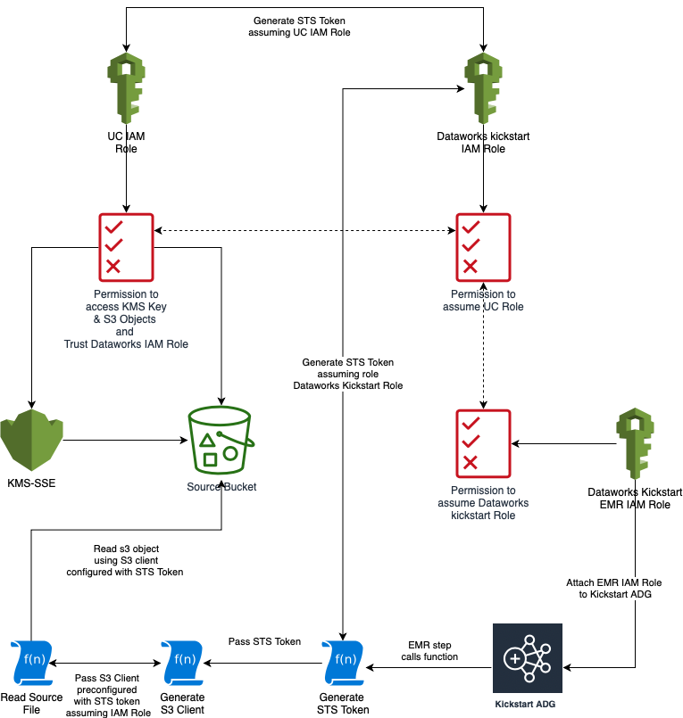

# dataworks-aws-kickstart-adg

The Kickstart Analytical Dataset Generation (ADG) cluster is an ETL cluster which extract data kickstart data from different buckets and transform it into parquet files stored on S3 bucket. It then
generates Hive tables to provide downstream data processing & analytics tasks
with convenient SQL access to that data.

# Overview


1. At a defined time, a CloudWatch event will trigger the `EMR Launcher` Lambda function
1. The `EMR Launcher` reads EMR Cluster configuration files from the `Config` S3 bucket, then calls the `RunJobFlow` API of the EMR service which results in an
`Kickstart ADG` EMR cluster being launched
1. The `Kickstart ADG` is configured as an ETL cluster; a PySpark step run on the cluster reads files from cross account 
`Input` S3 bucket using STS token and produces Parquet files in the `Output` S3 bucket.
1. The PySpark step then creates external Hive tables over those S3 objects,
storing the table definitions in a existing Hive Metastore
1. Once processing is complete, the `Kickstart ADG Cluster` terminates.

# Source Data Access



1. `Kickstart ADG EMR cluster` runs on attach service role `kickstart_adg_emr_service_role`
1. The `kickstart_adg_emr_service_role` has permission to assume role `kickstart_s3_readonly` and The `kickstart_s3_readonly` has permission to assume cross account role `dataworks-ksr`
1. The  PySpark step runs a function `get_sts_token` to generate STS Token using role chaining mechanism. The STS token is then passed to a function `get_s3_client` to generate S3 client. The S3 client is passed to a function `get_list_keys_for_prefix` to check if the file is present or not.
1. If the file is present in remote bucket than generated STS token is passed to a function `source_extraction`. This function first sets the below mentioned configuration.
   ```
    spark.sparkContext._jsc.hadoopConfiguration().set("fs.s3.awsCredentialsProvider", "org.apache.hadoop.fs.s3.TemporaryAWSCredentialsProvider")
    spark.sparkContext._jsc.hadoopConfiguration().set("fs.s3.awsAccessKeyId", sts_token["Credentials"]["AccessKeyId"])
    spark.sparkContext._jsc.hadoopConfiguration().set("fs.s3.awsSecretAccessKey", sts_token["Credentials"]["SecretAccessKey"])
    spark.sparkContext._jsc.hadoopConfiguration().set("fs.s3.awsSessionToken", sts_token["Credentials"]["SessionToken"])
   ```
   and read the source file from s3 bucket and create spark dataframe

# Schema Evolution


1. Schema Evolution process logic has implemented with intention that whenever there is any change in source schema then dataworks datapipeline picks up the changes and evolve the hive schema accordingly
1. The logic for schema evolution is present in a function `get_evolved_schema`

# Catchup Mode


1. Catchup Mode has been implemented with intention that whenever there is a downtime and data pipeline has not run for somedays. In that scenario when data pipeline when triggered normally than it will automatically start process from where it has left.

** please note :- There is a lifecycle policy implemented on s3 source bucket with 7 days retention period. If the downtime is increasing more than 7 days than we have to co-ordinate with source system to handle the scenario. 

1. Catchup Mode works when the process is trigger via cloudwatch event. If we are using CI Admin job to start cluster than catchup mode differ based on the dates provided by admin jobs. For more details please refer to section 

# End to End Test

1. Data pipeline will use the existing Dataworks Behaviour framework. The test features related can be found in this link [Kickstart ADG e2e test features](https://github.com/dwp/dataworks-behavioural-framework/blob/master/src/features/kickstart-adg.feature)

# CI Jobs


1. Kickstart build pipeline has been configured using existing concourse CI framework used based other dataworks pipelines
1. kickstart build pipeline below mention jobs
   ```
    master --> This job propagates the changes related to data pipeline into different environment
    pull-request --> This job gets triggered whenever the Pull Request(PR) is raised for merging into Master
    start-cluster --> This job is admin job which is used for starting the cluster in different environment.
    Stop-cluster --> This job is used for stopping any running cluster
    generate-test-data --> This job is used for generating the test data in development environment
   ```
1. Whenever the changes are merged from feature to master branch in repos `dataworks-aws-kickstart-adg` and `emr-launcher` the build pipeline gets automatically triggered.

# Restartability

1. In order to restart the process, separate CI process has been configured with start-cluster. when we want to start cluster we need to aviator the CI pipeline which change in parameter. 
1. Below table depicts the usage the following paramters when starting the CI process

| Parameter_Name | Is_Mandatory | Parameter_Value | Comments |
| -------------- | ------------ | ------------------- | -------- |
| START_DT | Optional |  2020-01-01 | This parameter value tells the job from which date we need to start the catchup run |
| END_DT | Optional | 2020-01-01 | This parameter value tells the job on which date we need to stop the processing |
| CLEAN_UP_FLG | Optional | False | This parameter value tells the job whether to perform clean up on output s3 bucket or not. "True" means clean up will happen and "False" means clean up will not happen. Please note setting this as True will clear the history. we need to make sure we historical files avaliable before we set it true  |
| E2E_TEST_FLG | Optional | False | This parameter value tells the job to read files from end to end test folder instead of source files if set to True. Please note if this is set to True in higher environment (Integration, Pre-Production and Production) then job will fail |

# Notification

| Notification_Type | Notification_Description | Notification_Slack_Channel |
| ----------------- | ------------------------ | -------------------------- |
| Information - Production | This is an information notification which tells the process is completed successfully. | #dataworks-aws-production-notifications |
| Error -  Production | This is an information notification which tells the process is failed. | #dataworks-aws-critical-alerts |
| Information & Error - Non Production | This is an information notification which tells the process is completed successfully or failed | #dataworks-aws-service-notifications |


# Some Example steps

1. Normal Run - In this scenario EMR steps are triggered using cloudwatch event scheduled time based on the steps mentioned `step.yaml.tpl` in cluster_config folder
```
spark-submit --master yarn --conf spark.yarn.submit.waitAppCompletion=true --py-files /opt/emr/spark/jobs.zip /opt/emr/spark/main.py --module_name vacanc
```

2. Adhoc Run -  In this scenario EMR steps are triggered using CI `start-cluster` jobs
```
spark-submit --master yarn --conf spark.yarn.submit.waitAppCompletion=true --py-files /opt/emr/spark/jobs.zip /opt/emr/spark/main.py --module_name vacancy --start_dt 2021-04-12 --end_dt 2021-04-12 --clean_up_flg False --e2e_test_flg False
```
